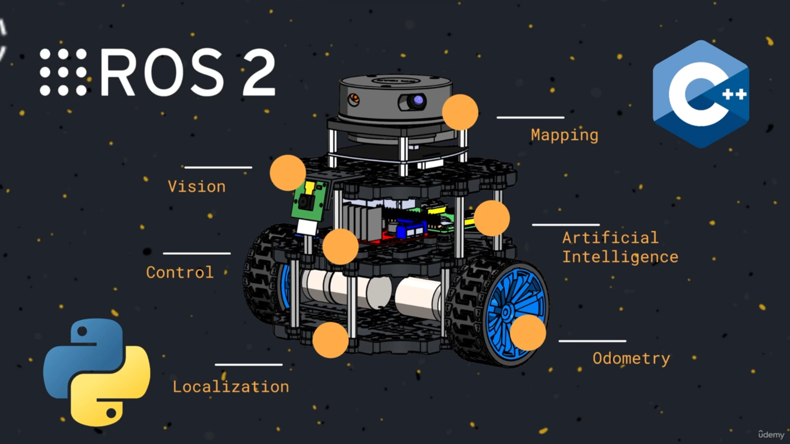
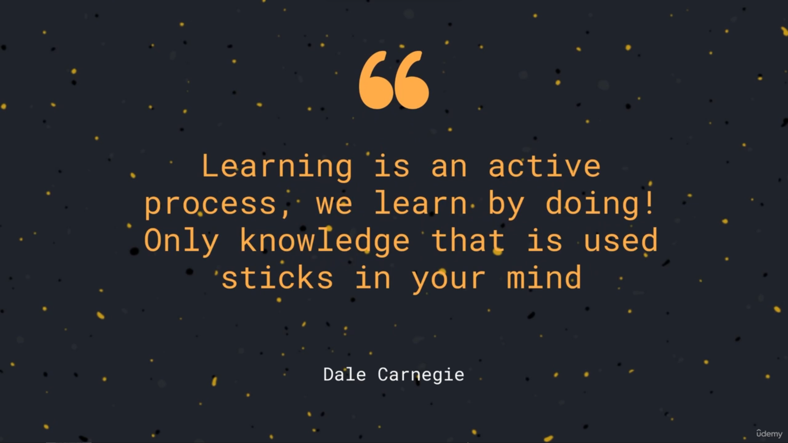
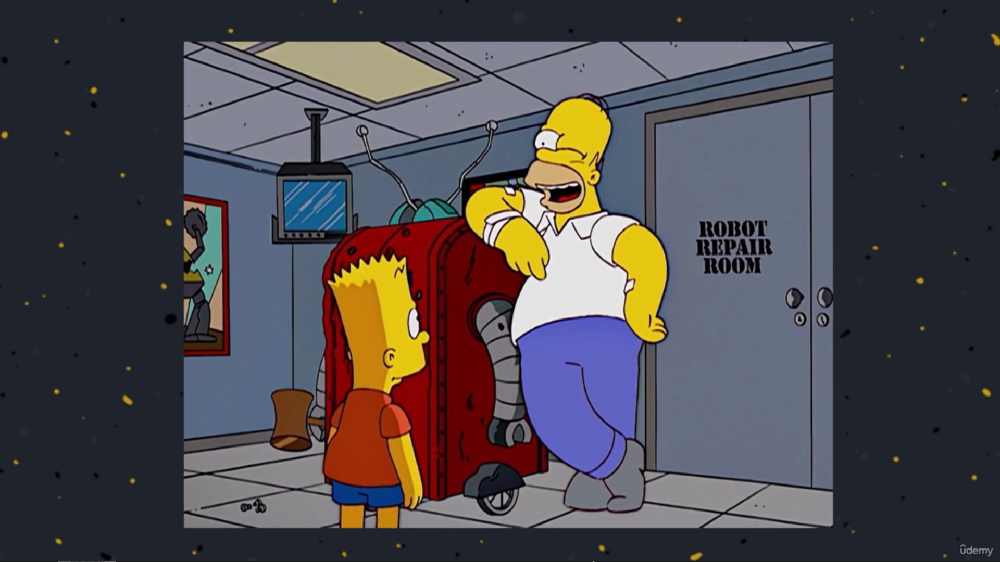

1. [Course Motivation](#1)
2. [The Self-Driving Program](#2)
3. [Course Presentation](#3)
4. [Meet your Teacher](#4)
5. [Get the Most out of the Course](#5)
6. [Course Material](#6)

---

### 1. Course Motivation

 

### 2. The Self-Driving Program

 

### 3. Course Presentation

 

### 4. Meet your Teacher

 

### 5. Get the Most out of the Course

 

### 6. Course Material

Hi Self-Driving enthusiast,

Attached to this lesson I provide you with all the relevant material that I will use during the course: code, 3D models of the robot, a list of components that you need to buy if you want to create your robot, course slides, notes, insights, pdf, my car’s keys 😂

If you are looking for something you’ll find it in the resources attached to this lesson and if you don’t find what you’re looking for, then I apologize in advance because probably I forgot to include it. So go to the Q&A section below and ask me for the missing attachments.

Here you will find all the code that we are going to develop during the course and here I’ll fix all the bugs that you will kindly report to me (and where I’ll add some new ones 🙂)

[Github](https://github.com/AntoBrandi/Self-Driving-and-ROS-2-Learn-by-Doing-Map-Localization)

Here you will find the CAD and STL models of the robot components:

[STL of the Robot](https://drive.google.com/drive/folders/1zC3FLh2SO5ZTV7_gfTq6mb1malznKxjX)

[CAD of the Robot](https://drive.google.com/drive/folders/1LK-31Wqt77E1MqK6rOLBmrO8tsrp96K_)

Here you can find the STL files to feed your 3D Printer 🖨️

[STL 3D Printer](https://drive.google.com/drive/folders/1KbKv_tV9Ur0QNMxUbI7MXCr7At-GKyDi)

Here you will find the PDF with the slides of the lessons that you can use during the quiz😈:

[Lesson's Slides](https://drive.google.com/drive/folders/1B17TVdUhaMX_aqlIAjHOYZsNzQbQxMiq)

Here you will find the list of components needed to assemble the robot, the sensors, and the electronic parts. I added some like where you can buy the components (I’m not affiliated with these stores, so I’m not earning anything from these purchases 😔 then buy from the store you prefer)

[BOM to build the Robot](https://drive.google.com/drive/folders/1SpWvF2Fhi0wAnrziODPiBaPJB8L1eita)

[Electronics and Schematic](https://drive.google.com/drive/folders/1wpuOML7HgphndDBiKx75ORiMExRpFBSy)

 
