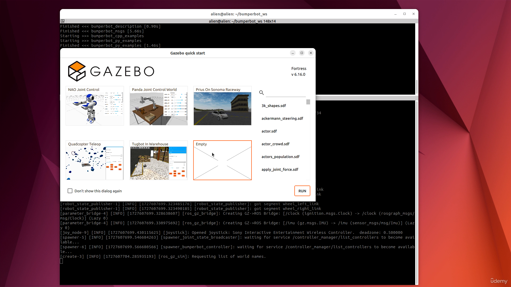
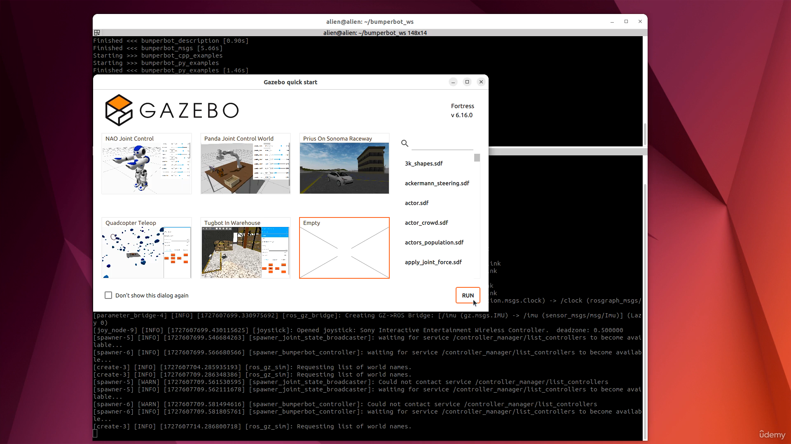
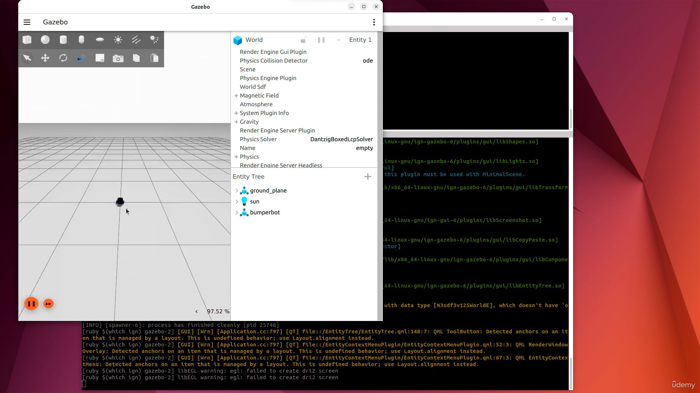
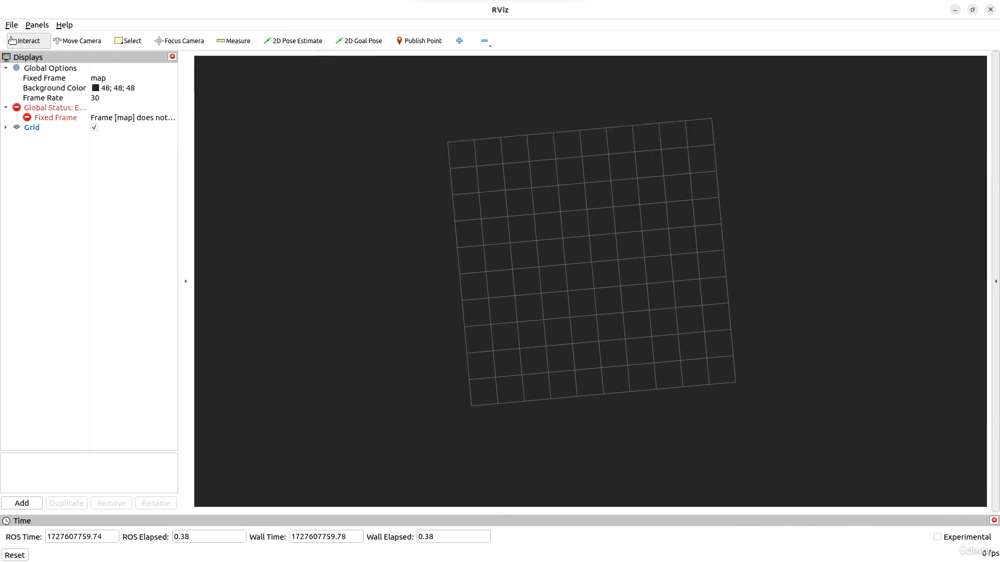
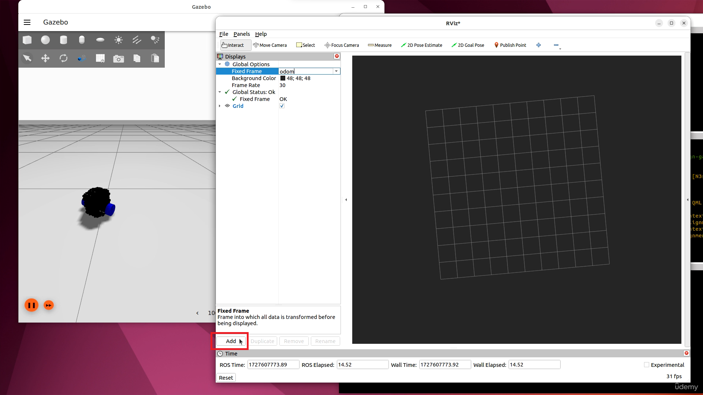
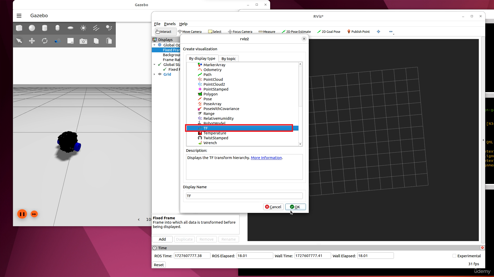
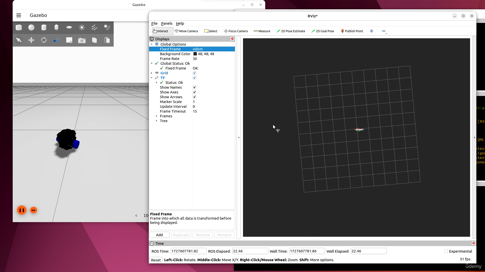
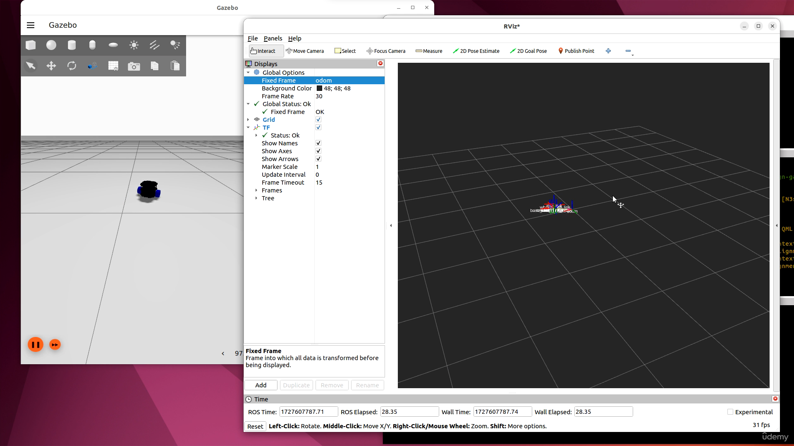
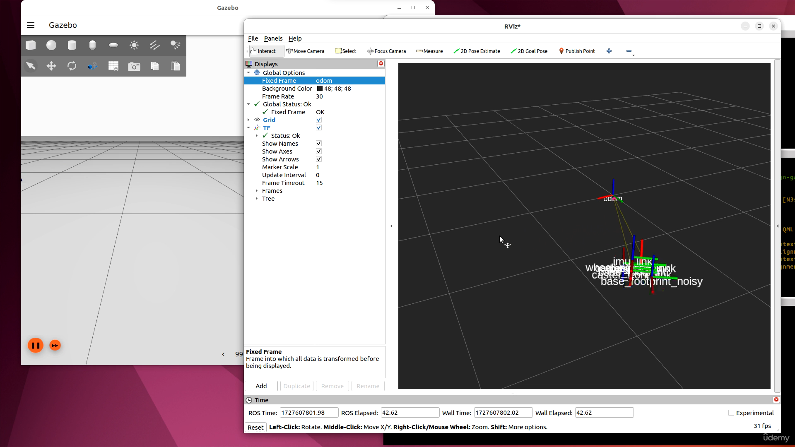

### 7. [Install Ubuntu on Virtual Machine](#7)<a id='7.'></a>

8. [Install Ubuntu on Dual Boot](#8)
9. [<LAB>Install ROS 2 Jazzy on Ubuntu 24.04</LAB>](#9)
10. [<LAB>Install ROS 2 Humble on Ubuntu 22.04</LAB>](#10)
11. [<LAB>Configure the Development Environment</LAB>](#11)
12. [<HWLAB>Configure the Development Environment in Raspberry Pi</HWLAB>](#12)
13. [<HWLAB>Install ROS 2 on Raspberry Pi</HWLAB>](#13)
14. [<LAB>Getting Started with the Simulated Robot</LAB>](#14)
15. [<HWLAB>Assemble the Robot - Part 1</HWLAB>](#15)
16. [<HWLAB>Assemble the Robot - Part 2</HWLAB>](#16)
17. [<HWLAB>Assemble the Robot - Part 3</HWLAB>](#17)

---

### 7. Install Ubuntu on Virtual Machine<a id='7'></a>

refer section

<br>

### 8. Install Ubuntu on Dual Boot<a id='8'></a>

refer section

<br>

### 9. <LAB>Install ROS 2 Jazzy on Ubuntu 24.04</LAB><a id='9'></a>

Documentation [ROS 2 Humble](https://docs.ros.org/en/jazzy/Installation/Ubuntu-Install-Debs.html)

<br>

### 10. <LAB>Install ROS 2 Humble on Ubuntu 22.04</LAB><a id='10'></a>

- Instruction [manual](https://github.com/joysmith/Self-Driving-and-ROS-2---Learn-by-Doing-Map-Localization/blob/main/02%20Setup/resources/Ubuntu%2B22.04%2BInstall%2BROS%2B2%2BHumble.pdf)

- Documentation [ROS 2 Humble](https://docs.ros.org/en/humble/Installation/Ubuntu-Install-Debs.html)

<br>

### 11. <LAB>Configure the Development Environment</LAB><a id='11'></a>

1. Download and Install [VS code editor](https://code.visualstudio.com/download)
2. VS code extension for ROS [youtube link](https://www.youtube.com/watch?v=PBbEhRf8QjE&list=PL2dJBq8ig-vihvDVw-D5zAYOArTMIX0FA)

- C/C++ by microsoft
- python by microsoft
- CMake by microsoft
- CMake Tools by microsoft
- XML by red hat
- XML Tools by Josh jhonson
- ROS by microsoft

3. Updating with new Terminal

```sh
sudo apt-get update
sudo apt-get upgrade
sudo apt-get install terminator
```

#### shortcut

- ctrl + shift + a: To open new terminal window on side
- ctrl + shift + o: To open new terminal window on bottom

4. Downalod bumperbot [project file](https://github.com/joysmith/Self-Driving-and-ROS-2---Learn-by-Doing-Map-Localization/blob/main/02%20Setup/resources/bumperbot_ws.zip)

5. Go to bumperbot workspace using terminal to install other dependencies

```sh
cd bumperbot_ws
sudo rosdep init
rosdep update
rosdep install --from-paths src -y --ignore-src
sudo apt-get install python3-pip
pip install transforms3d
```

<br>

### 12. <HWLAB>Configure the Development Environment in Raspberry Pi</HWLAB><a id='12'></a>

- Download [Raspberry pi image](https://www.raspberrypi.com/software/)

- Commands

```txt
File /etc/udev/rules.d/81-event.rules

SUBSYSTEM=="input", KERNEL=="event*", GROUP="raspberry", MODE="0660"


File /etc/udev/rules.d/99-arduino.rules

SUBSYSTEMS=="usb", ATTRS{idVendor}=="2341", GROUP="plugdev", MODE="0666
```

<br>

### 13. <HWLAB>Install ROS 2 on Raspberry Pi</HWLAB><a id='13'></a>

<br>

### 14. <LAB>Getting Started with the Simulated Robot</LAB><a id='14'></a>

1. Go to bumperbot_ws with terminal and run following cmds

```sh
rosdep install --from-paths src -y

#🔴 In case it show some error put package name in cmd
rosdep install --from-paths src -y --ignore-src --skip-keys "bumperbot_msgs bumperbot_description bumperbot_controller bumperbot_firmware"
colcon build

```

2. ctrl + shift + o: To open new Terminal window on bottom, in same bumperbot_ws

```sh
. install/setup.bash

# launch simulation also connect gamepad with pc
ros2 launch bumperbot_bringup simulated_robot.launch.py
```

Note: do not check "Do not show msg, as it has some bug , can cause crash problem"




#### Joystick to control robot by pressing deadman-button



3. ctrl + shift + o: To open new Terminal window on bottom, in same bumperbot_ws

```sh
rviz2
```














<br>

### 15. <HWLAB>Assemble the Robot - Part 1</HWLAB><a id='15'></a>

<br>

### 16. <HWLAB>Assemble the Robot - Part 2</HWLAB><a id='16'></a>

<br>

### 17. <HWLAB>Assemble the Robot - Part 3</HWLAB><a id='17'></a>
