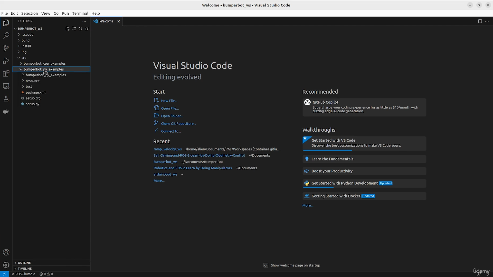
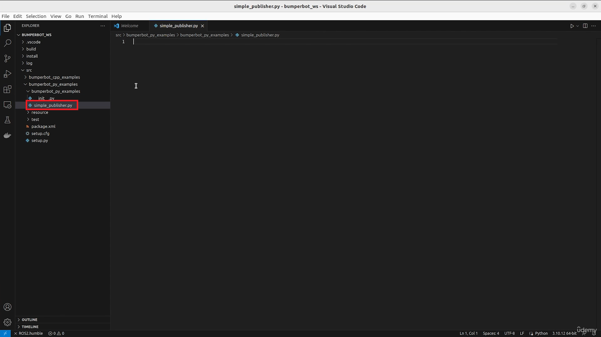
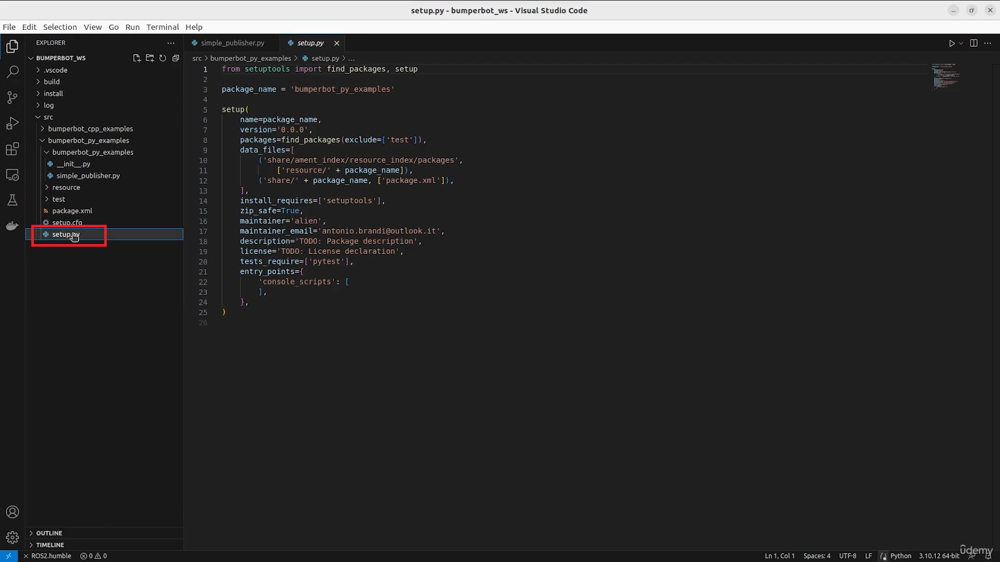
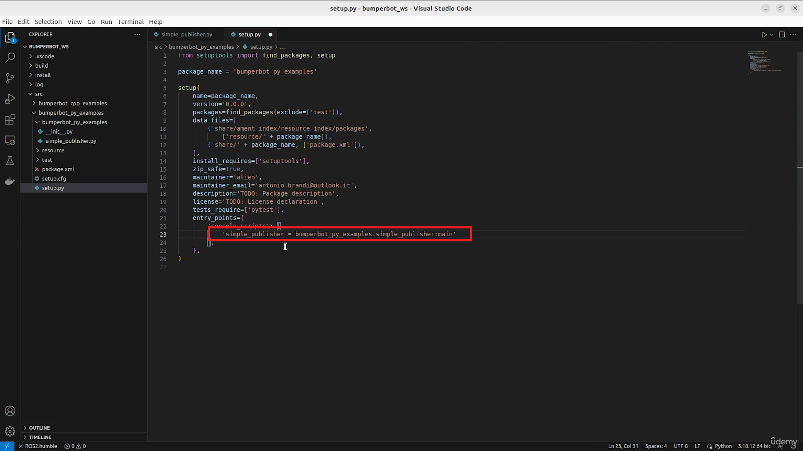
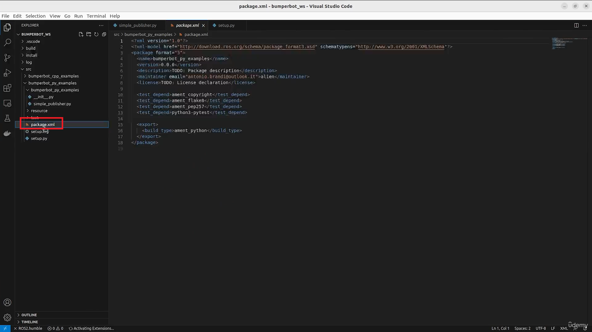
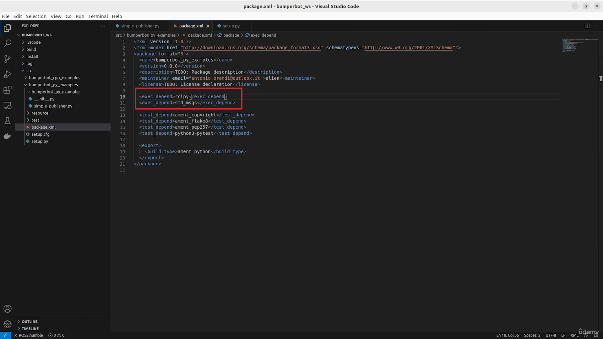
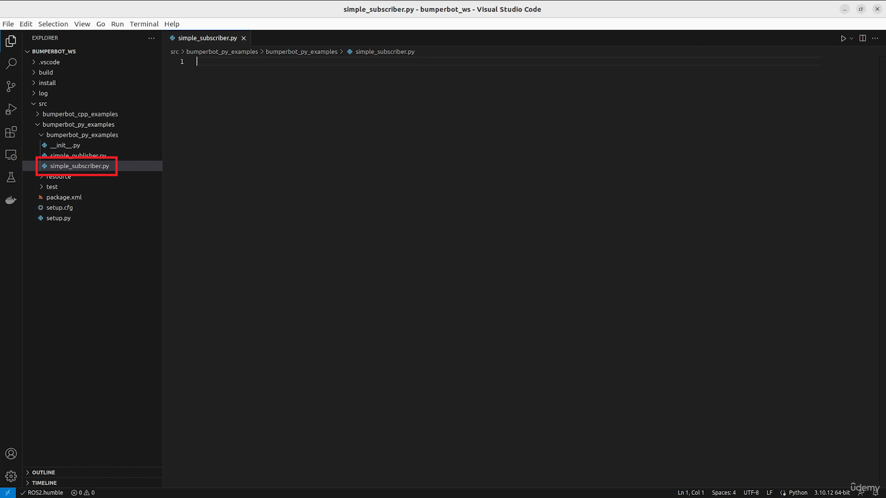
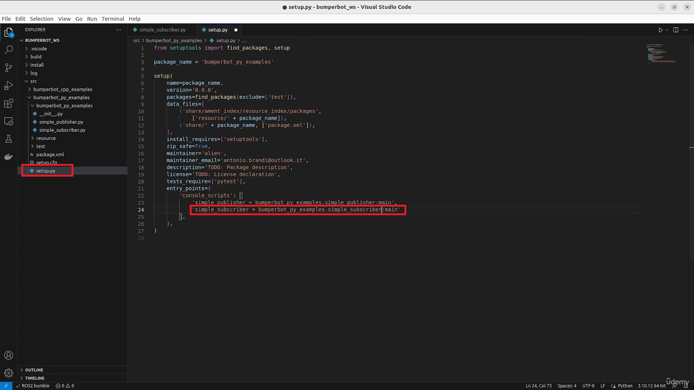

18. [Why a Robot Operating System?](#18)
19. [What is ROS 2](#19)
20. [Why a NEW Robot Operating System](#20)
21. [ROS 2 Architecture](#21)
22. [Hardware Abstraction](#22)
23. [Low-Level Device Control](#23)
24. [Messaging Between Process](#24)
25. [Package Management](#25)
26. [Architecture of a ROS 2 Application](#26)
27. [<LAB>Create and Activate a Worksapce</LAB>](#27)
28. [<PY>Simple Publisher</PY>](#28)
29. [<C++>Simple Publisher</C++>](#29)
30. [<PY>Simple Subscriber</PY>](#30)
31. [<C++>Simple Subscriber</C++>](#31)

---

### 18. Why a Robot Operating System?<a id='18'>/<a>

- [Slides](https://github.com/joysmith/Self-Driving-and-ROS-2---Learn-by-Doing-Map-Localization/blob/main/03%20Introducation%20to%20ROS%202/resources/Section3-Introduction-to-ROS-2.pdf)

<br>

### 19. What is ROS 2<a id='19'>/<a>

- [Slides](https://github.com/joysmith/Self-Driving-and-ROS-2---Learn-by-Doing-Map-Localization/blob/main/03%20Introducation%20to%20ROS%202/resources/Section3-Introduction-to-ROS-2.pdf)

<br>

### 20. Why a NEW Robot Operating System<a id='20'>/<a>

- [Slides](https://github.com/joysmith/Self-Driving-and-ROS-2---Learn-by-Doing-Map-Localization/blob/main/03%20Introducation%20to%20ROS%202/resources/Section3-Introduction-to-ROS-2.pdf)

<br>

### 21. ROS 2 Architecture<a id='21'>/<a>

- [Slides](https://github.com/joysmith/Self-Driving-and-ROS-2---Learn-by-Doing-Map-Localization/blob/main/03%20Introducation%20to%20ROS%202/resources/Section3-Introduction-to-ROS-2.pdf)

<br>

### 22. Hardware Abstraction<a id='22'>/<a>

- [Slides](https://github.com/joysmith/Self-Driving-and-ROS-2---Learn-by-Doing-Map-Localization/blob/main/03%20Introducation%20to%20ROS%202/resources/Section3-Introduction-to-ROS-2.pdf)

<br>

### 23. Low-Level Device Control<a id='23'>/<a>

- [Slides](https://github.com/joysmith/Self-Driving-and-ROS-2---Learn-by-Doing-Map-Localization/blob/main/03%20Introducation%20to%20ROS%202/resources/Section3-Introduction-to-ROS-2.pdf)

<br>

### 24. Messaging Between Process<a id='24'>/<a>

- [Slides](https://github.com/joysmith/Self-Driving-and-ROS-2---Learn-by-Doing-Map-Localization/blob/main/03%20Introducation%20to%20ROS%202/resources/Section3-Introduction-to-ROS-2.pdf)

<br>

### 25. Package Management<a id='25'>/<a>

- [Slides](https://github.com/joysmith/Self-Driving-and-ROS-2---Learn-by-Doing-Map-Localization/blob/main/03%20Introducation%20to%20ROS%202/resources/Section3-Introduction-to-ROS-2.pdf)

<br>

### 26. Architecture of a ROS 2 Application<a id='26'>/<a>

- [Slides](https://github.com/joysmith/Self-Driving-and-ROS-2---Learn-by-Doing-Map-Localization/blob/main/03%20Introducation%20to%20ROS%202/resources/Section3-Introduction-to-ROS-2.pdf)

<br>

### 27. <LAB>Create and Activate a Worksapce</LAB><a id='27'>/<a>

#### Terminal 1

1. Create an Active working directory

```sh
# create a working director
mkdir -p bumperbot_ws/src
cd bumperbot_ws
colcon build
cd src/

# -- Creating package for c++ language
# create package, with  c++ language, name it "bumperbot_py_examples"
ros2 pkg create --build-type ament_python bumperbot_py_examples


# create package, with  python language, name it "bumperbot_cpp_examples"
ros2 pkg create --build-type ament_cmake bumperbot_cpp_examples

cd ..
colcon build

```

#### Terminal 2

2. ctrl + shift + o: To open new Terminal window on bottom, in same bumperbot_ws

```sh
# navigate to bumperbot_ws workspace from terminal
cd install/

# source the file
. setup.bash

ros2 pkg list
```

Note: always source the package whenever opening the new terminal, else terminal wont add created package

<br>

### 28. <PY>Simple Publisher</PY><a id='28'>/<a>

1. Open previously created bumperbot_ws in VS code



2. create simple_publisher.py-file under bumperbot_py_examples-folder



3. write code in simple_publisher.py-file

```py
import rclpy
from rclpy.node import Node
from std_msgs.msg import String


class SimplePublisher(Node):

    def __init__(self):
        super().__init__("simple_publisher")
        self.pub_ = self.create_publisher(String, "chatter", 10)
        self.counter_ = 0
        self.frequency_ = 1.0
        self.get_logger().info("Publishing at %d Hz" % self.frequency_)

        self.timer_ = self.create_timer(self.frequency_, self.timerCallback)

    def timerCallback(self):
        msg = String()
        msg.data = "Hello ROS 2 - counter: %d" % self.counter_
        self.pub_.publish(msg)
        self.counter_ += 1


def main():
    rclpy.init()

    simple_publisher = SimplePublisher()
    rclpy.spin(simple_publisher)

    simple_publisher.destroy_node()
    rclpy.shutdown()


if __name__ == '__main__':
    main()
```

4. Open setup.py-file



5. Adding file and main function to script



```py
from setuptools import setup

package_name = 'bumperbot_py_examples'

setup(
    name=package_name,
    version='0.0.0',
    packages=[package_name],
    data_files=[
        ('share/ament_index/resource_index/packages',
            ['resource/' + package_name]),
        ('share/' + package_name, ['package.xml']),
    ],
    install_requires=['setuptools'],
    zip_safe=True,
    maintainer='user',
    maintainer_email='antonio.brandi@outlook.it',
    description='ROS 2 Code Examples',
    license='Apache 2.0',
    tests_require=['pytest'],
    entry_points={
        'console_scripts': [

          # 1️⃣ adding file
            'simple_publisher = bumperbot_py_examples.simple_publisher:main'
        ],
    },
)
```

6. Declaring dependencies in package.xml-file





```xml
<?xml version="1.0"?>
<?xml-model href="http://download.ros.org/schema/package_format3.xsd" schematypens="http://www.w3.org/2001/XMLSchema"?>
<package format="3">
  <name>bumperbot_py_examples</name>
  <version>0.0.0</version>
  <description>ROS 2 Code Examples</description>
  <maintainer email="antonio.brandi@outlook.it">Antonio Brandi</maintainer>
  <license>Apache 2.0</license>

<!-- 1️⃣ added dependencies -->
  <depend>rclpy</depend>
  <depend>std_msgs</depend>

  <test_depend>ament_copyright</test_depend>
  <test_depend>ament_flake8</test_depend>
  <test_depend>ament_pep257</test_depend>
  <test_depend>python3-pytest</test_depend>

  <export>
    <build_type>ament_python</build_type>
  </export>
</package>
```

#### 1:Terminal

7. Open bumperbot_ws with terminal

```sh
# bumperbot_ws
colcon build
```

#### 2:Terminal

8. ctrl + shift + o: To open new Terminal window on bottom, in same bumperbot_ws

```sh
# sourcing file
. install/setup.bash

# run
ros2 run bumperbot_py_examples simple_publisher
```

#### 3:Terminal

9. Testing topic: ctrl + shift + o: To open new Terminal window on bottom, in same bumperbot_ws

```sh
ros2 topic list

ros2 topic echo /chatter

ros2 topic info /chatter --verbose

ros2 topic hz /chatter
```

<br>

### 29. <C++>Simple Publisher</C++><a id='29'>/<a>

<br>

### 30. <PY>Simple Subscriber</PY><a id='30'>/<a>

1. Create new simple_subscriber.py-file under bumperbot_py_examples-folder



```sh
import rclpy
from rclpy.node import Node
from std_msgs.msg import String


class SimpleSubscriber(Node):

# Constructor function
    def __init__(self):
        super().__init__("simple_subscriber")
        self.sub_ = self.create_subscription(String, "chatter", self.msgCallback, 10)
        self.sub_

    def msgCallback(self, msg):
        self.get_logger().info("I heard: %s" % msg.data)


# automatic executable function
def main():
    rclpy.init()

    # create new instance of SimpleSubscriber
    simple_publisher = SimpleSubscriber()
    rclpy.spin(simple_publisher)

    simple_publisher.destroy_node()
    rclpy.shutdown()


if __name__ == '__main__':
    main()
```

2. Open setup.py-file



```py
from setuptools import setup

package_name = 'bumperbot_py_examples'

setup(
    name=package_name,
    version='0.0.0',
    packages=[package_name],
    data_files=[
        ('share/ament_index/resource_index/packages',
            ['resource/' + package_name]),
        ('share/' + package_name, ['package.xml']),
    ],
    install_requires=['setuptools'],
    zip_safe=True,
    maintainer='user',
    maintainer_email='antonio.brandi@outlook.it',
    description='ROS 2 Code Examples',
    license='Apache 2.0',
    tests_require=['pytest'],
    entry_points={
        'console_scripts': [
            'simple_publisher = bumperbot_py_examples.simple_publisher:main',

            # 1️⃣ adding script
            'simple_subscriber = bumperbot_py_examples.simple_subscriber:main',
        ],
    },
)
```

#### 1:Terminal

3. Open bumperbot_ws with terminal

```sh
# bumperbot_ws
colcon build
```

#### 2:Terminal

4. ctrl + shift + o: To open new Terminal window on bottom, in same bumperbot_ws

```sh
# sourcing file
. install/setup.bash

# run
ros2 run bumperbot_py_examples simple_subscriber
```

#### 3:Terminal

5. Testing topic: ctrl + shift + o: To open new Terminal window on bottom, in same bumperbot_ws

```sh
ros2 topic list

ros2 topic info /chatter --verbose

ros2 topic pub /chatter std_msgs/msg/string "data: 'Hello ROS 2'"

# . install/setup.bash
# ros2 run bumperbot_cpp_examples simple_publisher
```

<br>

### 31. <C++>Simple Subscriber</C++><a id='31'>/<a>
