40. [Where am I ?](#40)
41. [Robot Localization](#41)
42. [Robotics Convention for Localization](#42)
43. [Why a Robotics Convention for Localization?](#43)
44. [Gazebo Worlds and Models](#44)
45. [<LAB>Give an house to the Robot</LAB>](#45)
46. [Local and Global Localization](#46)
47. [Local Localization](#47)
48. [Global Localization](#48)
49. [Wheel Odometry Errors](#49)
50. [Laser Odometry Errors](#50)
51. [The Real Purpose of Global Localization](#51)
52. [Error Propagation](#52)
53. [Odometry Motion Model](#53)
54. [<PY>Odometry Motion Model</PY>](#54)
55. [<PY>Odometry Motion Model with Noise</PY>](#55)
56. [<C++>Odometry Motion Model</C++>](#56)
57. [<C++>Odometry Motion Model with Noise</C++>](#57)
58. [<LAB>Odometry Motion Model</LAB>](#58)

---

### 40. Where am I ?<a id='40'></a>

- refer [slides](https://github.com/joysmith/Self-Driving-and-ROS-2-Learn-by-Doing-Map-Localization/blob/main/05%20Gloabal%20localization/resources/Section5-Global_Localization.pdf)

<br>

### 41. Robot Localization<a id='41'></a>

- refer [slides](https://github.com/joysmith/Self-Driving-and-ROS-2-Learn-by-Doing-Map-Localization/blob/main/05%20Gloabal%20localization/resources/Section5-Global_Localization.pdf)

<br>

### 42. Robotics Convention for Localization<a id='42'></a>


- refer [slides](https://github.com/joysmith/Self-Driving-and-ROS-2-Learn-by-Doing-Map-Localization/blob/main/05%20Gloabal%20localization/resources/Section5-Global_Localization.pdf)

<br>

### 43. Why a Robotics Convention for Localization?<a id='43'></a>

A company created his robot reference frame


<br>

A company robot reference frame coordinate system Vs Human coordinate system


<br>

A combination of robot reference frame coordinate system with Human coordinate system


- refer [slides](https://github.com/joysmith/Self-Driving-and-ROS-2-Learn-by-Doing-Map-Localization/blob/main/05%20Gloabal%20localization/resources/Section5-Global_Localization.pdf)

<br>

### 44. Gazebo Worlds and Models<a id='44'></a>

To test robot on different environment


<br>

We can create our own 3d model using blender3D


- refer [slides](https://github.com/joysmith/Self-Driving-and-ROS-2-Learn-by-Doing-Map-Localization/blob/main/05%20Gloabal%20localization/resources/Section5-Global_Localization.pdf)

<br>

### 45. <LAB>Give an house to the Robot</LAB><a id='45'></a>

3d world by amazon[aws-robomaker-small-house-world](https://github.com/aws-robotics/aws-robomaker-small-house-world)

1. Download following zip file and extract them

   - [world](https://github.com/joysmith/Self-Driving-and-ROS-2-Learn-by-Doing-Map-Localization/blob/main/05%20Gloabal%20localization/resources/45/worlds.zip)
   - [model](https://github.com/joysmith/Self-Driving-and-ROS-2-Learn-by-Doing-Map-Localization/blob/main/05%20Gloabal%20localization/resources/45/models.zip)
   - [photo](https://github.com/joysmith/Self-Driving-and-ROS-2-Learn-by-Doing-Map-Localization/blob/main/05%20Gloabal%20localization/resources/45/photos.zip)

2. now cut all 3 folder(world, model, photo) and paste in bumperbot_ws/src/bumperbot_description/---here---

3. Open bumperbot_ws in VS code, in project file open CMakeList.txt, add model folder in install section

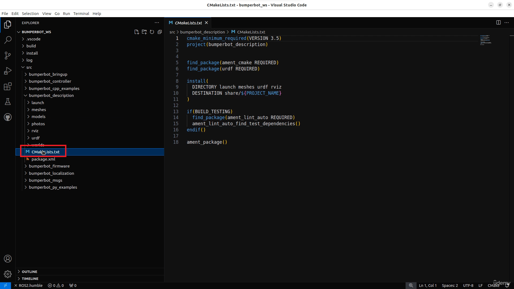

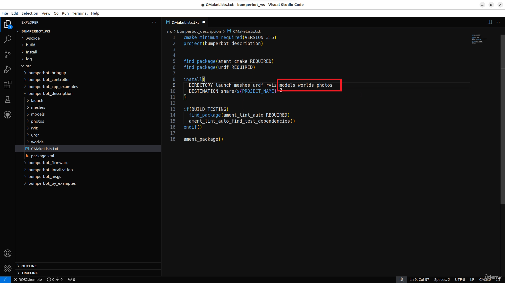

4. Editing gazebo.launch.py-file located in: bumperbot_ws/src/bumperbot_description/launch/gazebo.launch.py

```py
import os

# 5️⃣ import pathsep from os module
from os import pathsep

from pathlib import Path
from ament_index_python.packages import get_package_share_directory

from launch import LaunchDescription
from launch.actions import DeclareLaunchArgument, IncludeLaunchDescription, SetEnvironmentVariable

# 1️⃣ importing module PathJoinSubstitution, PythonExpression
from launch.substitutions import Command, LaunchConfiguration, PathJoinSubstitution, PythonExpression
from launch.launch_description_sources import PythonLaunchDescriptionSource

from launch_ros.actions import Node
from launch_ros.parameter_descriptions import ParameterValue


def generate_launch_description():
    bumperbot_description = get_package_share_directory("bumperbot_description")

    model_arg = DeclareLaunchArgument(
        name="model", default_value=os.path.join(
                bumperbot_description, "urdf", "bumperbot.urdf.xacro"
            ),
        description="Absolute path to robot urdf file"
    )


# 2️⃣ setting up new custom 3d model
    world_name_arg = DeclareLaunchArgument(name="world_name", default_value="empty")
    world_path = PathJoinSubstitution([
            bumperbot_description,
            "worlds",
            PythonExpression(expression=["'", LaunchConfiguration("world_name"), "'", " + '.world'"])
        ]
    )

# 4️⃣ setting up 3d-models path
    model_path = str(Path(bumperbot_description).parent.resolve())
    model_path += pathsep + os.path.join(get_package_share_directory("bumperbot_description"), 'models')
    gazebo_resource_path = SetEnvironmentVariable(
        "GZ_SIM_RESOURCE_PATH",
        model_path
        )


    ros_distro = os.environ["ROS_DISTRO"]
    is_ignition = "True" if ros_distro == "humble" else "False"

    robot_description = ParameterValue(Command([
            "xacro ",
            LaunchConfiguration("model"),
            " is_ignition:=",
            is_ignition
        ]),
        value_type=str
    )

    robot_state_publisher_node = Node(
        package="robot_state_publisher",
        executable="robot_state_publisher",
        parameters=[{"robot_description": robot_description,
                     "use_sim_time": True}]
    )

    gazebo = IncludeLaunchDescription(
                PythonLaunchDescriptionSource([os.path.join(
                    get_package_share_directory("ros_gz_sim"), "launch"), "/gz_sim.launch.py"]),
                launch_arguments={
                  # 3️⃣ setting up dictionary
                    "gz_args": PythonExpression(["'", world_path, " -v 4 -r'"])
                }.items()
             )

    gz_spawn_entity = Node(
        package="ros_gz_sim",
        executable="create",
        output="screen",
        arguments=["-topic", "robot_description",
                   "-name", "bumperbot"],
    )

    gz_ros2_bridge = Node(
        package="ros_gz_bridge",
        executable="parameter_bridge",
        arguments=[
            "/clock@rosgraph_msgs/msg/Clock[gz.msgs.Clock",
            "/imu@sensor_msgs/msg/Imu[gz.msgs.IMU"
        ],
        remappings=[
            ('/imu', '/imu/out'),
        ]
    )

    return LaunchDescription([
        model_arg,

        # 6️⃣ adding
        world_name_arg,

        gazebo_resource_path,
        robot_state_publisher_node,
        gazebo,
        gz_spawn_entity,
        gz_ros2_bridge
    ])
```

5. Open bumperbot_ws in terminal

```sh
colcon build
```

6. ctrl + shift + o: To open new Terminal window on bottom, in same bumperbot_ws

```sh
. install/setup.bash

# launch simulation also connect gamepad with pc
ros2 launch bumperbot_description gazebo.launch.py
# stop simulation


# launch simulation in new setting i.e small house
ros2 launch bumperbot_description gazebo.launch.py world_name:=small_house
# stop simulation

# launch simulation in new setting i.e small warehouse
ros2 launch bumperbot_description gazebo.launch.py world_name:=small_warehouse

```

default
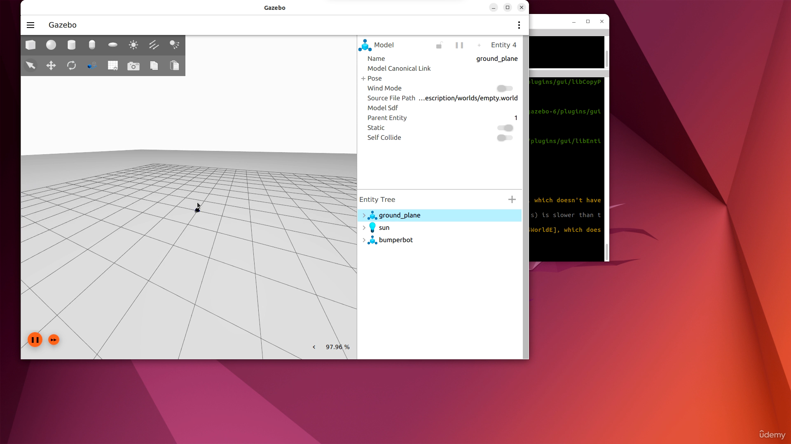

<br>

small house
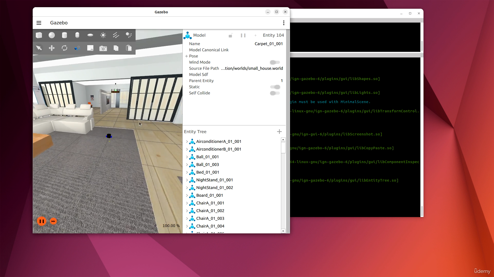

<br>

small warehouse
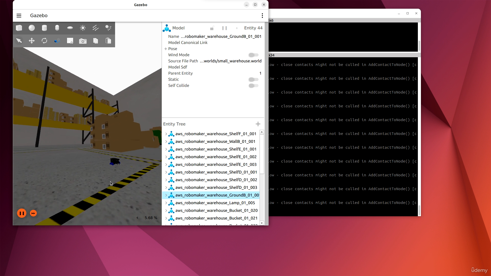

<br>

### 46. Local and Global Localization<a id='46'></a>

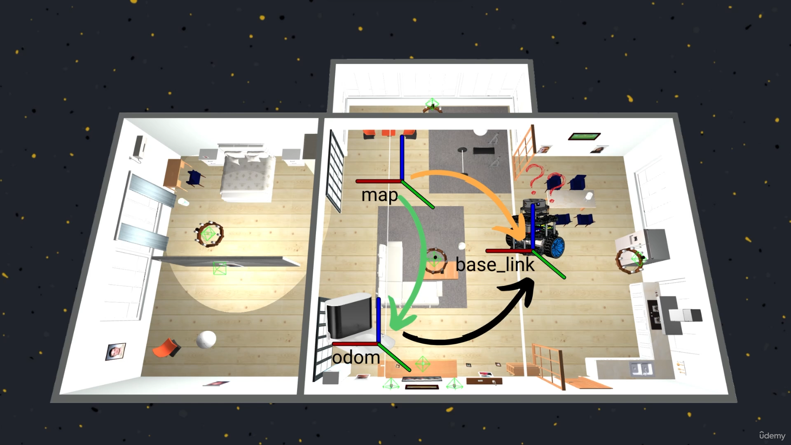

map reference frame: fixed reference point
odom reference frame: robot initial starting point for example robot charging station or home location
base_link reference frame: reference pont of robot while in motion

- refer [slides](https://github.com/joysmith/Self-Driving-and-ROS-2-Learn-by-Doing-Map-Localization/blob/main/05%20Gloabal%20localization/resources/Section5-Global_Localization.pdf)

<br>

### 47. Local Localization<a id='47'></a>

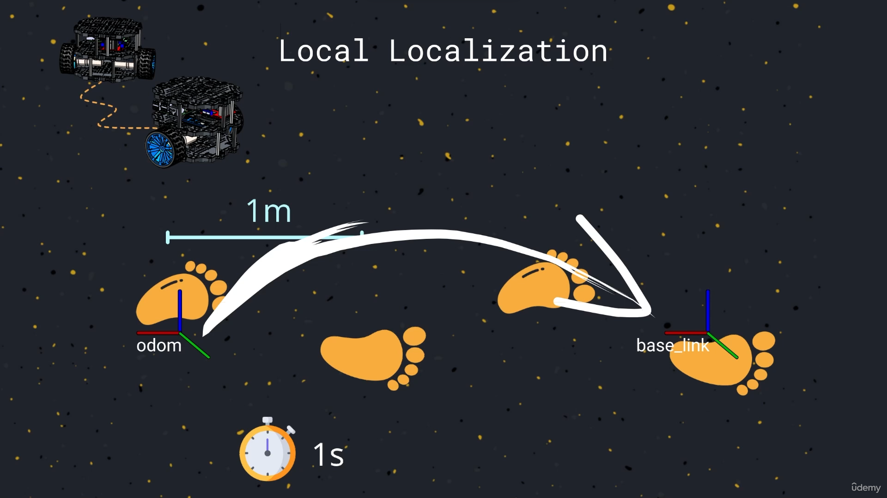

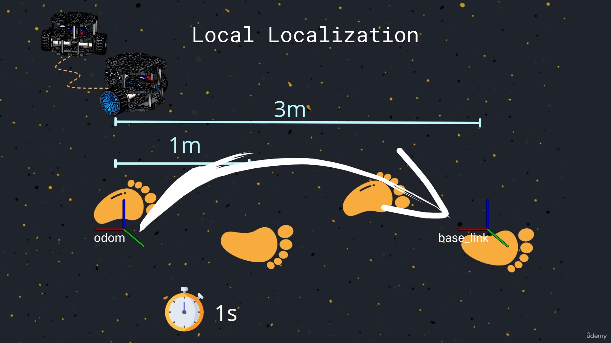

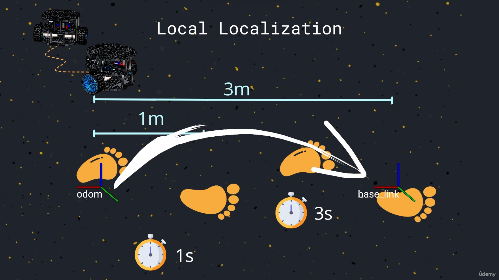

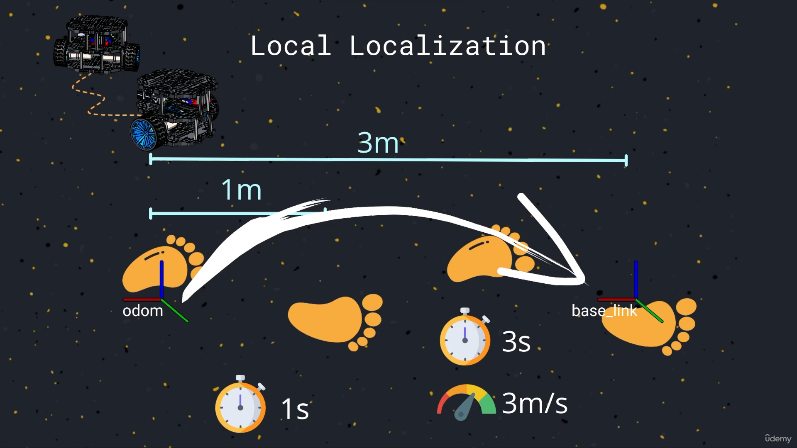

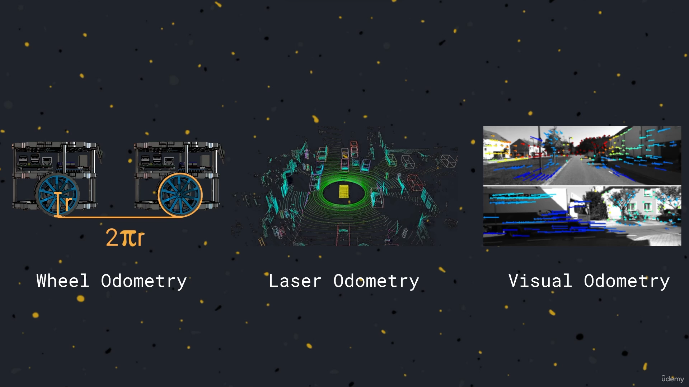

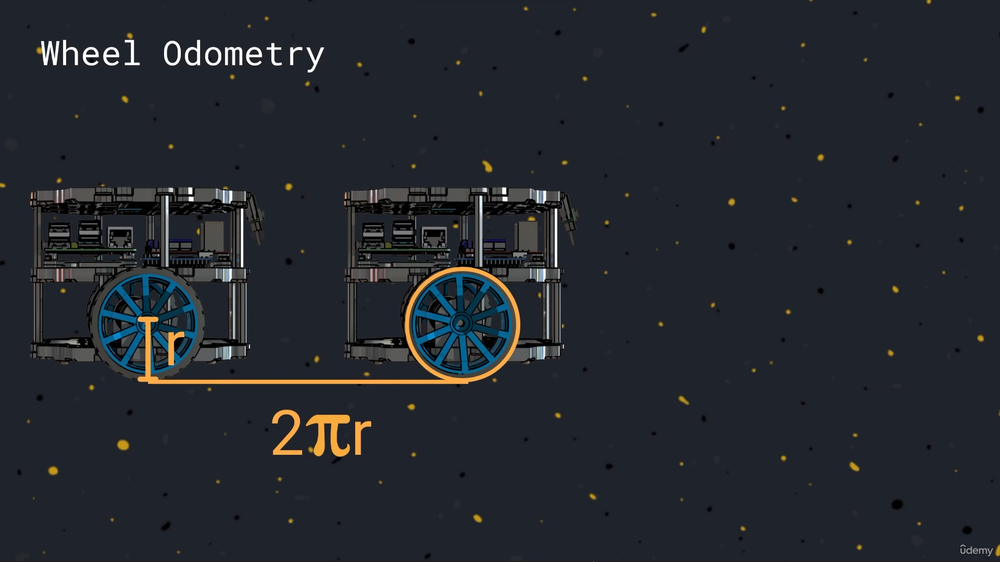

- refer [slides](https://github.com/joysmith/Self-Driving-and-ROS-2-Learn-by-Doing-Map-Localization/blob/main/05%20Gloabal%20localization/resources/Section5-Global_Localization.pdf)

Notice:

Odometry aka localization

we can measure following parameter

- robot speed in m/sec
- robot distance in meter
- robot time taken to travel distance in sec

<br>

### 48. Global Localization<a id='48'></a>

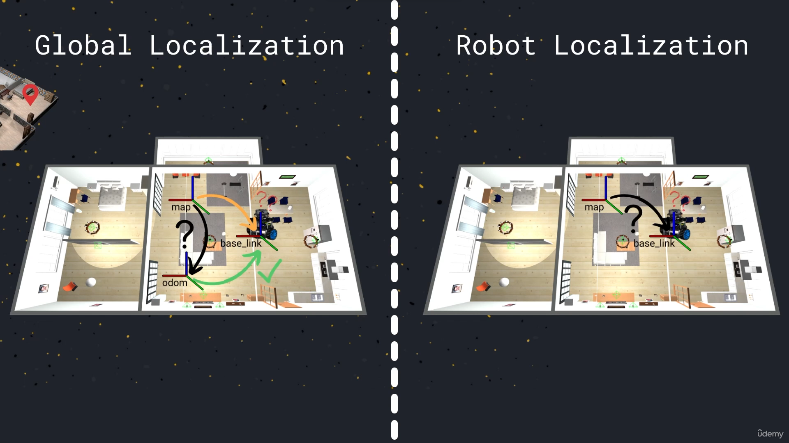

- refer [slides](https://github.com/joysmith/Self-Driving-and-ROS-2-Learn-by-Doing-Map-Localization/blob/main/05%20Gloabal%20localization/resources/Section5-Global_Localization.pdf)

<br>

### 49. Wheel Odometry Errors<a id='49'></a>

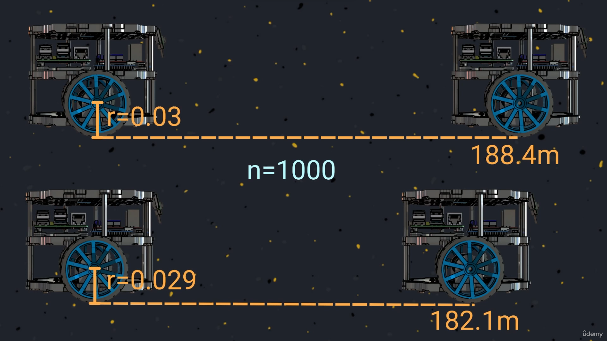

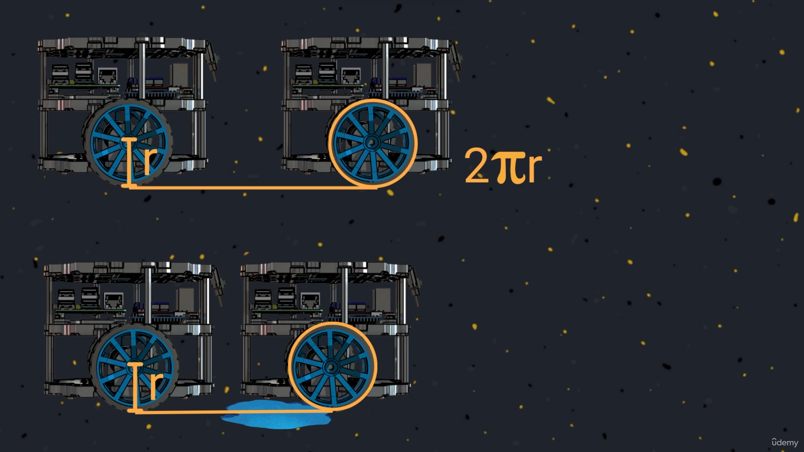

- refer [slides](https://github.com/joysmith/Self-Driving-and-ROS-2-Learn-by-Doing-Map-Localization/blob/main/05%20Gloabal%20localization/resources/Section5-Global_Localization.pdf)

<br>

### 50. Laser Odometry Errors<a id='50'></a>

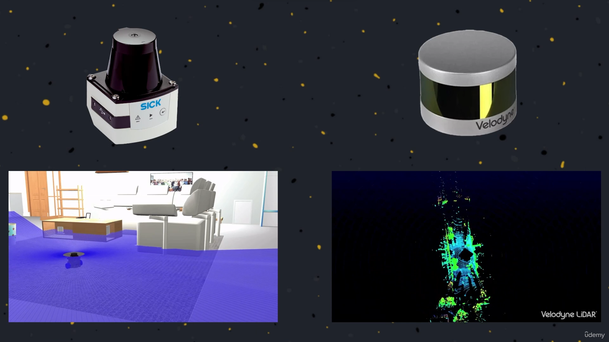

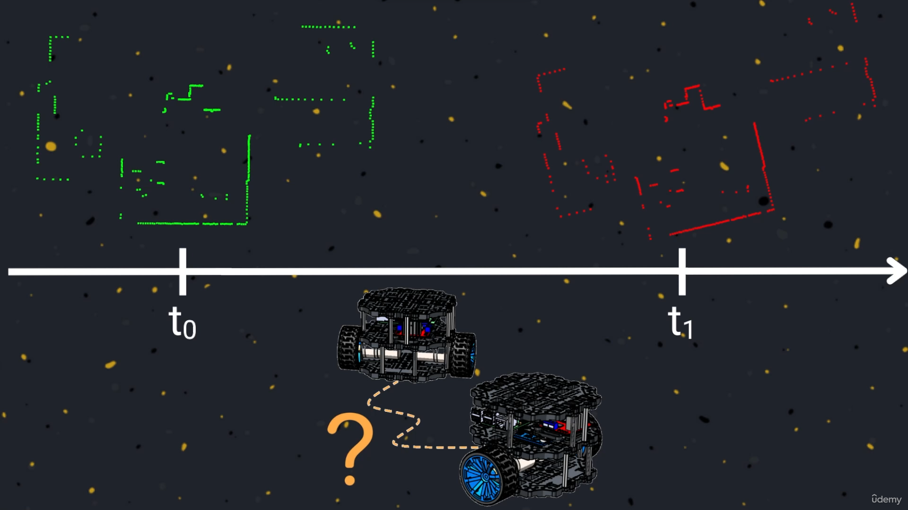

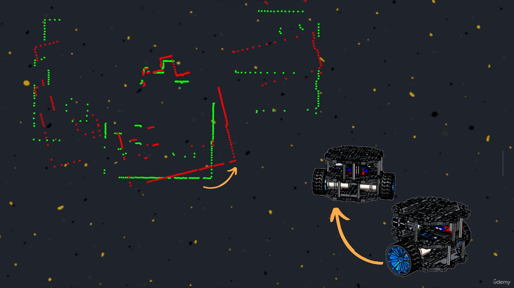

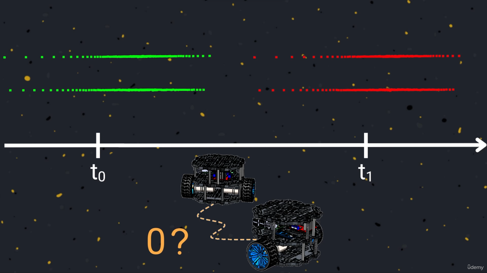

- refer [slides](https://github.com/joysmith/Self-Driving-and-ROS-2-Learn-by-Doing-Map-Localization/blob/main/05%20Gloabal%20localization/resources/Section5-Global_Localization.pdf)

<br>

### 51. The Real Purpose of Global Localization<a id='51'></a>

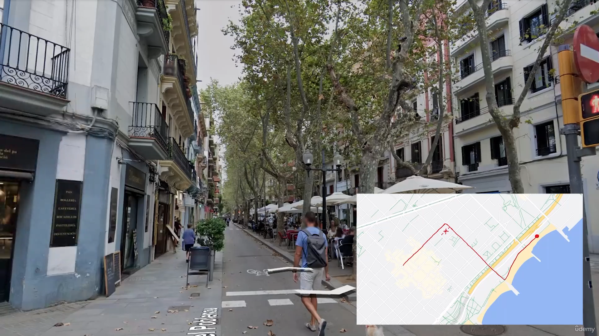

- refer [slides](https://github.com/joysmith/Self-Driving-and-ROS-2-Learn-by-Doing-Map-Localization/blob/main/05%20Gloabal%20localization/resources/Section5-Global_Localization.pdf)

<br>

### 52. Error Propagation<a id='52'></a>

<br>

### 53. Odometry Motion Model<a id='53'></a>

<br>

### 54. <PY>Odometry Motion Model</PY><a id='54'></a>

<br>

### 55. <PY>Odometry Motion Model with Noise</PY><a id='55'></a>

<br>

### 56. <C++>Odometry Motion Model</C++><a id='56'></a>

<br>

### 57. <C++>Odometry Motion Model with Noise</C++><a id='57'></a>

<br>

### 58. <LAB>Odometry Motion Model</LAB><a id='58'></a>

<br>
