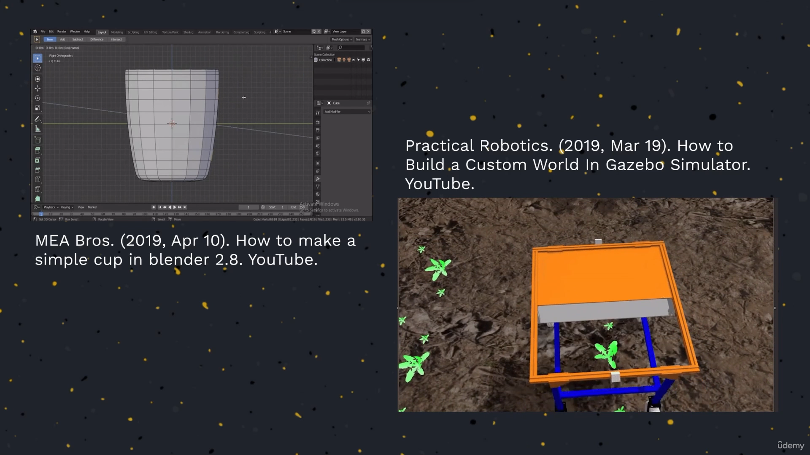

40. [Where am I ?](#40)
41. [Robot Localization](#41)
42. [Robotics Convention for Localization](#42)
43. [Why a Robotics Convention for Localization?](#43)
44. [Gazebo Worlds and Models](#44)
45. [<LAB>Give an house to the Robot</LAB>](#45)
46. [Local and Global Localization](#46)
47. [Local Localization](#47)
48. [Global Localization](#48)
49. [Wheel Odometry Errors](#49)
50. [Laser Odometry Errors](#50)
51. [The Real Purpose of Global Localization](#51)
52. [Error Propagation](#52)
53. [Odometry Motion Model](#53)
54. [<PY>Odometry Motion Model</PY>](#54)
55. [<PY>Odometry Motion Model with Noise</PY>](#55)
56. [<C++>Odometry Motion Model</C++>](#56)
57. [<C++>Odometry Motion Model with Noise</C++>](#57)
58. [<LAB>Odometry Motion Model</LAB>](#58)

---

### 40. Where am I ?

- refer [slides](https://github.com/joysmith/Self-Driving-and-ROS-2-Learn-by-Doing-Map-Localization/blob/main/05%20Gloabal%20localization/resources/Section5-Global_Localization.pdf)

 

### 41. Robot Localization

- refer [slides](https://github.com/joysmith/Self-Driving-and-ROS-2-Learn-by-Doing-Map-Localization/blob/main/05%20Gloabal%20localization/resources/Section5-Global_Localization.pdf)

 

### 42. Robotics Convention for Localization

- refer [slides](https://github.com/joysmith/Self-Driving-and-ROS-2-Learn-by-Doing-Map-Localization/blob/main/05%20Gloabal%20localization/resources/Section5-Global_Localization.pdf)

 

### 43. Why a Robotics Convention for Localization?

A company created his robot reference frame

 

A company robot reference frame coordinate system Vs Human coordinate system

 

A combination of robot reference frame coordinate system with Human coordinate system

- refer [slides](https://github.com/joysmith/Self-Driving-and-ROS-2-Learn-by-Doing-Map-Localization/blob/main/05%20Gloabal%20localization/resources/Section5-Global_Localization.pdf)

 

### 44. Gazebo Worlds and Models

To test robot on different environment

 

We can create our own 3d model using blender3D

- refer [slides](https://github.com/joysmith/Self-Driving-and-ROS-2-Learn-by-Doing-Map-Localization/blob/main/05%20Gloabal%20localization/resources/Section5-Global_Localization.pdf)

 

### 45. <LAB>Give an house to the Robot</LAB>

1. 3d world by amazon[aws-robomaker-small-house-world](https://github.com/aws-robotics/aws-robomaker-small-house-world)

 

### 46. Local and Global Localization

 

### 47. Local Localization

 

### 48. Global Localization

 

### 49. Wheel Odometry Errors

 

### 50. Laser Odometry Errors

 

### 51. The Real Purpose of Global Localization

 

### 52. Error Propagation

 

### 53. Odometry Motion Model

 

### 54. <PY>Odometry Motion Model</PY>

 

### 55. <PY>Odometry Motion Model with Noise</PY>

 

### 56. <C++>Odometry Motion Model</C++>

 

### 57. <C++>Odometry Motion Model with Noise</C++>

 

### 58. <LAB>Odometry Motion Model</LAB>

 
