59. [What is a Map](#59)
60. [How Robots Perceive the World](#60)
61. [Sensors for Self-Driving Robots](#61)
62. [1D Sensors - Sonar](#62)
63. [2D Sensors - LiDAR](#63)
64. [<LAB>Add a 2D LiDAR to the Robot</LAB>](#64)
65. [<LAB>Simulate a 2D LiDAR</LAB>](#65)
66. [3D Sensors - RGBD Cameras and 3D LiDAR](#66)
67. [Speed and Separation Monitoring](#67)
68. [twist_mux](#68)
69. [<PY>Twist Relay</PY>](#69)
70. [<C++>Twist Relay</C++>](#70)
71. [<LAB>Configure twist_mux</LAB>](#71)
72. [<LAB>Use twist_mux</LAB>](#72)
73. [<PY>Safety Stop</PY>](#73)
74. [<C++>Safety Stop</C++>](#74)
75. [<LAB>Safety Stop</LAB>](#75)
76. [ROS 2 Actions](#76)
77. [<PY>Create an Action Server</PY>](#77)
78. [<C++>Create an Action Server</C++>](#78)
79. [<LAB>Create an Action Server</LAB>](#79)
80. [<PY>Create an Action Client</PY>](#80)
81. [<C++>Create an Action Client</C++>](#81)
82. [<LAB>Create an Action Client</LAB>](#82)
83. [<PY>Speed and Separation Monitoring</PY>](#83)
84. [<C++>Speed and Separation Monitoring</C++>](#84)
85. [<LAB>Speed and Separation Monitoring</LAB>](#85)
86. [<PY>Display Markers in RViz</PY>](#86)
87. [<C++>Display Markers in RViz</C++>](#87)
88. [<LAB>Display Markers in RViz</LAB>](#88)

---

### 59. What is a Map

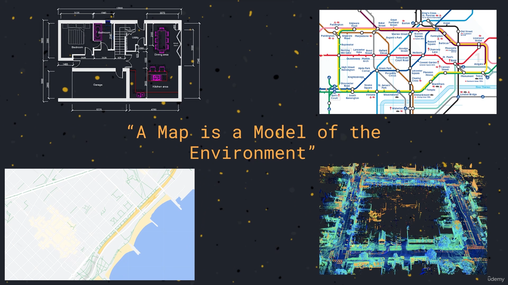

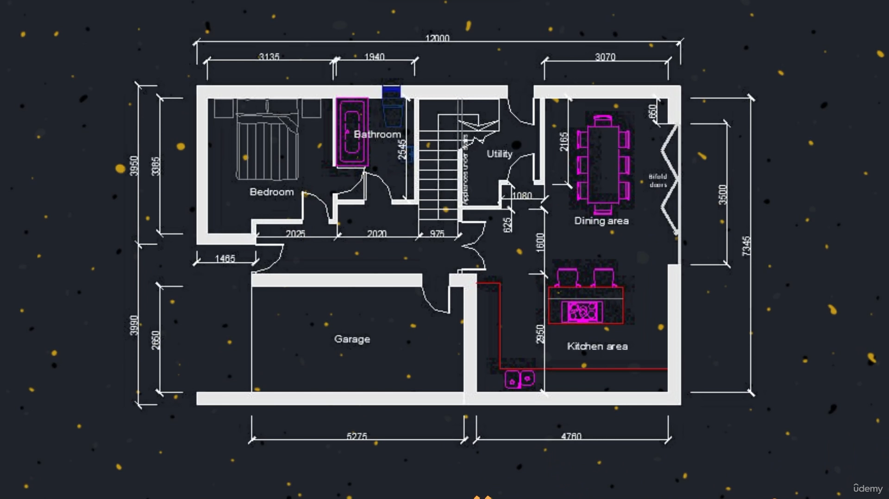

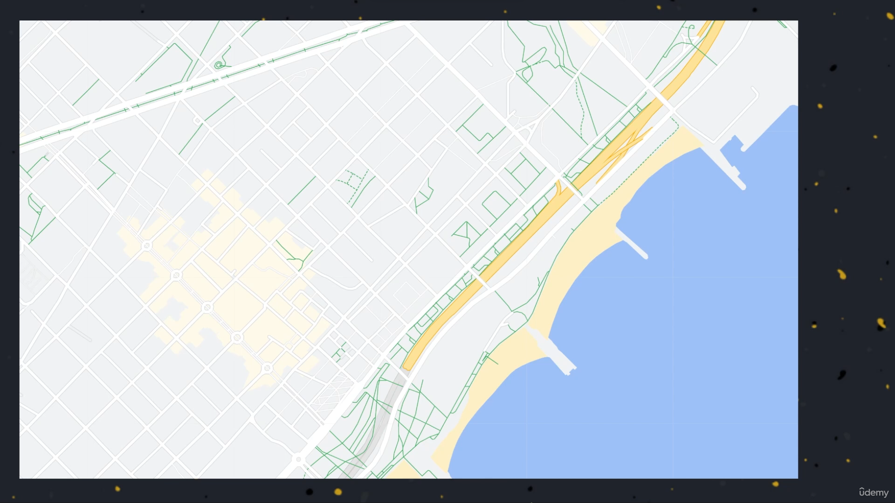

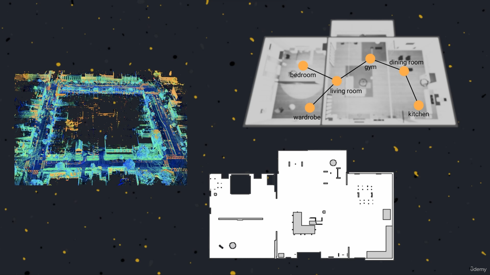

- refer [slides](https://github.com/joysmith/Self-Driving-and-ROS-2-Learn-by-Doing-Map-Localization/blob/main/06%20Sensors%20for%20localization%20and%20mapping/resources/Section6-Sensors_for_Localization_and_Mapping.pdf)

 

### 60. How Robots Perceive the World

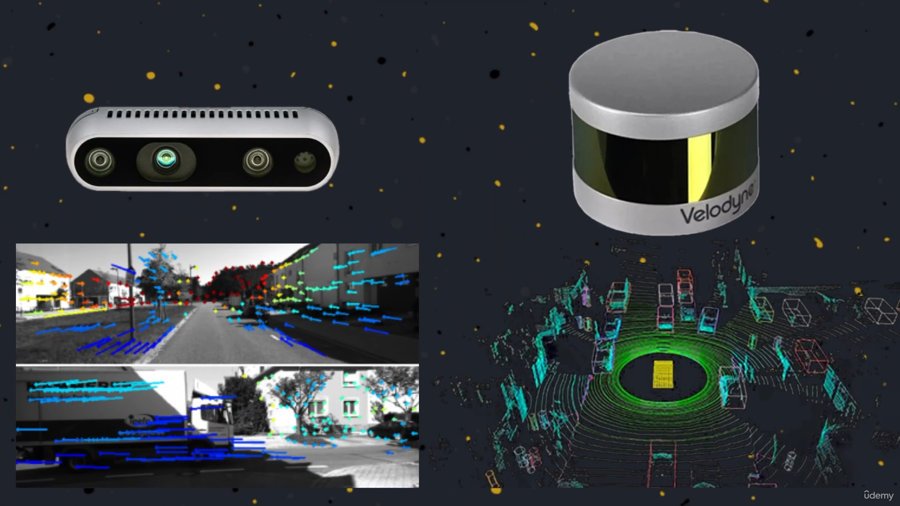

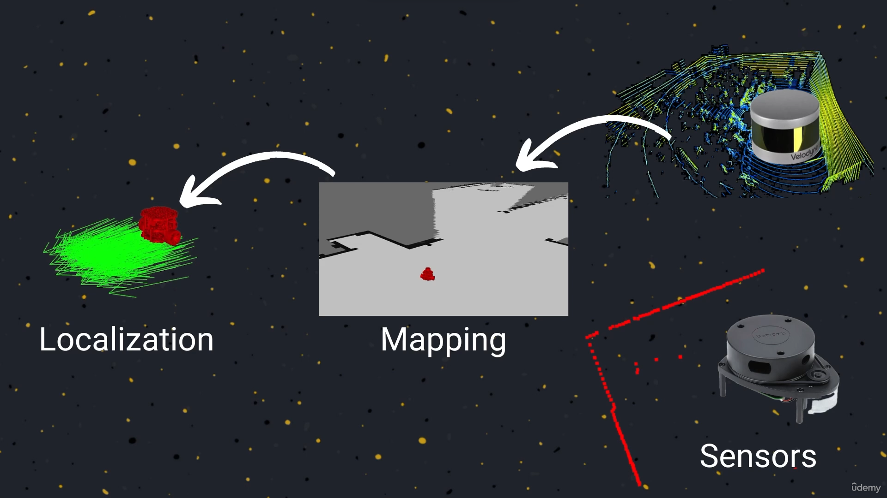

- refer [slides](https://github.com/joysmith/Self-Driving-and-ROS-2-Learn-by-Doing-Map-Localization/blob/main/06%20Sensors%20for%20localization%20and%20mapping/resources/Section6-Sensors_for_Localization_and_Mapping.pdf)

Note:

- accuracy of map depend upon accuracy of sensor

 

### 61. Sensors for Self-Driving Robots

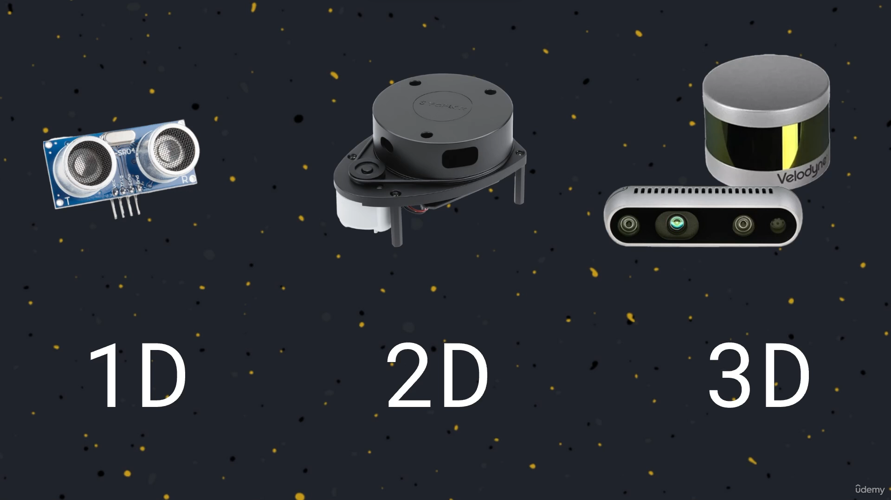

- refer [slides](https://github.com/joysmith/Self-Driving-and-ROS-2-Learn-by-Doing-Map-Localization/blob/main/06%20Sensors%20for%20localization%20and%20mapping/resources/Section6-Sensors_for_Localization_and_Mapping.pdf)

 

### 62. 1D Sensors - Sonar

Ultrasonic wave propagation
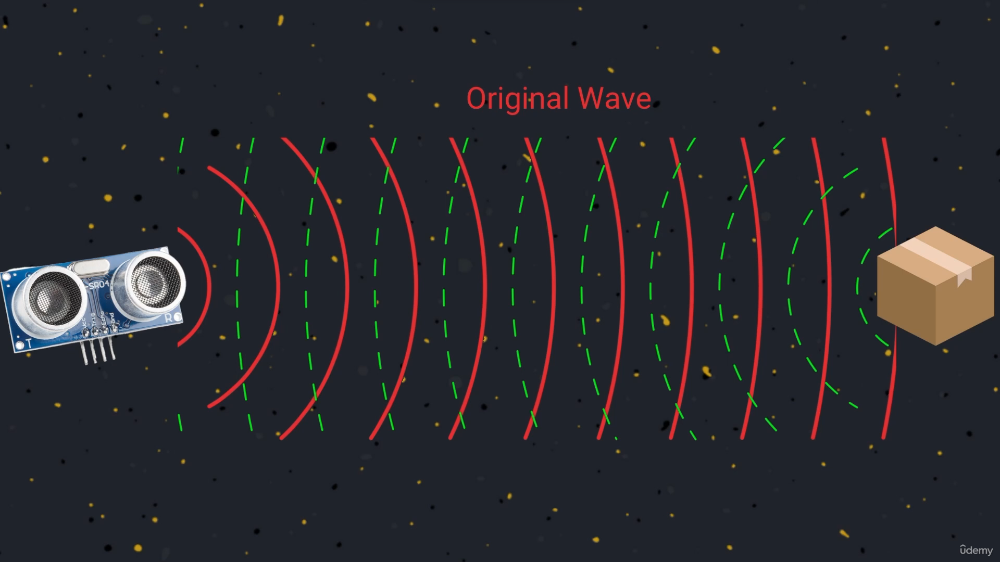

How to measure distance between robot and obstacle
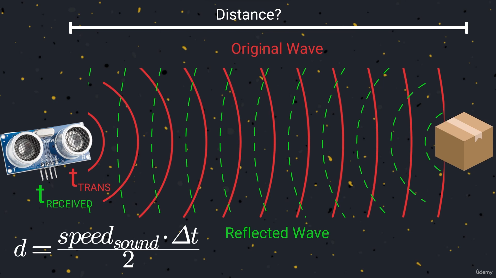

 

#### measurement error

Ultrasonic wave propagation speed changes in diff. medium

 

Ultrasonic wave deflected to another angle due shape of obstacle
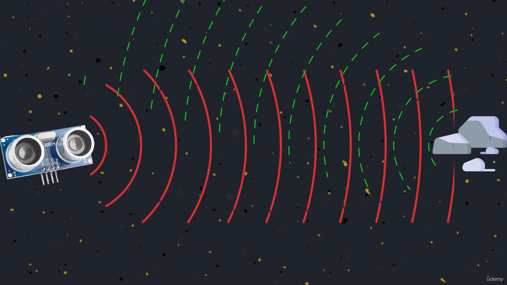

 

Some materials absorb sound waves
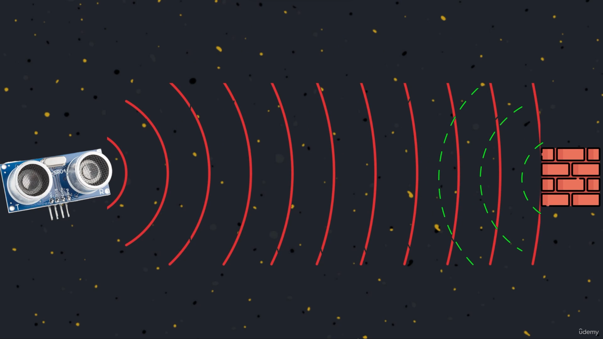

- refer [slides](https://github.com/joysmith/Self-Driving-and-ROS-2-Learn-by-Doing-Map-Localization/blob/main/06%20Sensors%20for%20localization%20and%20mapping/resources/Section6-Sensors_for_Localization_and_Mapping.pdf)

 

### 63. 2D Sensors - LiDAR

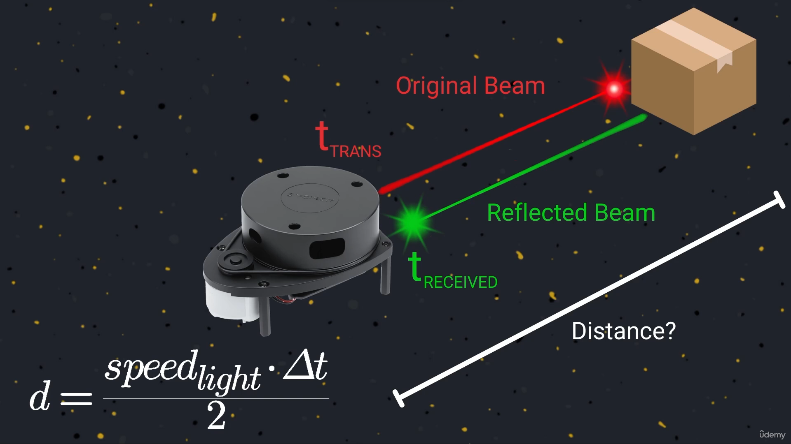

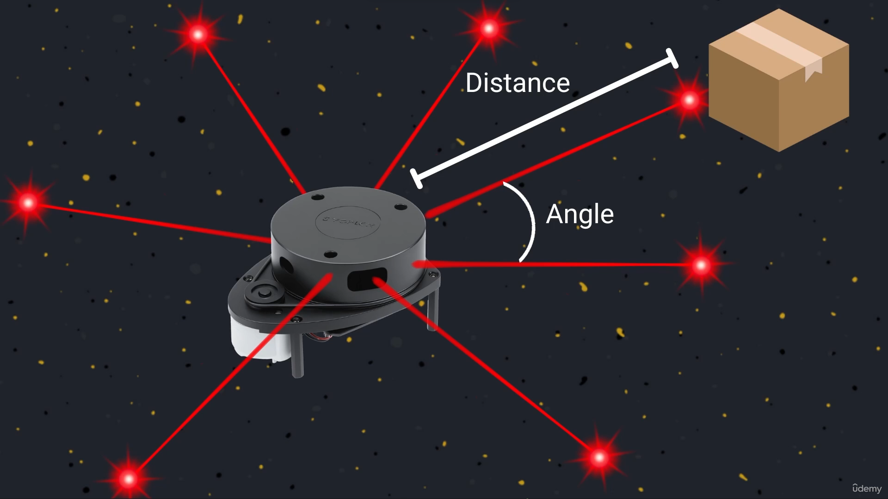

 

#### measurement error

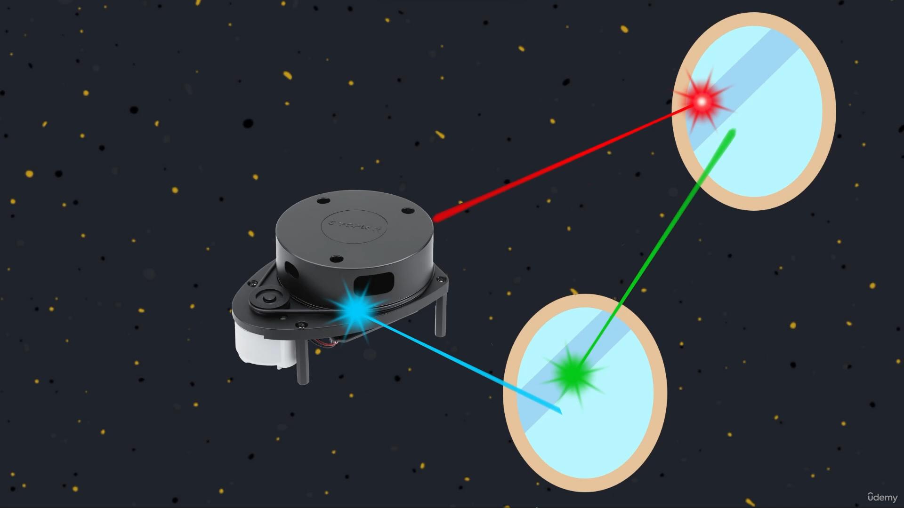

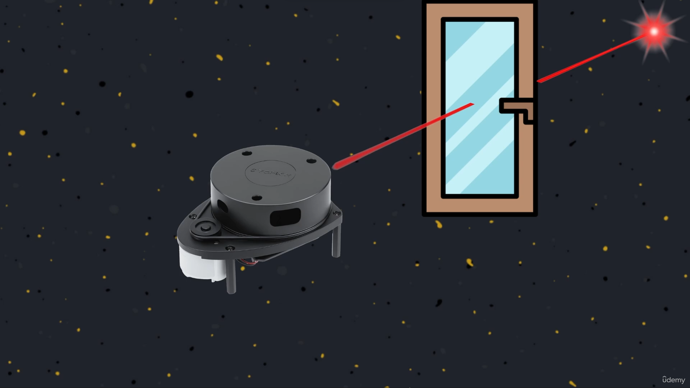

- refer [slides](https://github.com/joysmith/Self-Driving-and-ROS-2-Learn-by-Doing-Map-Localization/blob/main/06%20Sensors%20for%20localization%20and%20mapping/resources/Section6-Sensors_for_Localization_and_Mapping.pdf)

 

### 64. <LAB>Add a 2D LiDAR to the Robot</LAB>

- refer [slides](https://github.com/joysmith/Self-Driving-and-ROS-2-Learn-by-Doing-Map-Localization/blob/main/06%20Sensors%20for%20localization%20and%20mapping/resources/Section6-Sensors_for_Localization_and_Mapping.pdf)

 

### 65. <LAB>Simulate a 2D LiDAR</LAB>

- refer [slides](https://github.com/joysmith/Self-Driving-and-ROS-2-Learn-by-Doing-Map-Localization/blob/main/06%20Sensors%20for%20localization%20and%20mapping/resources/Section6-Sensors_for_Localization_and_Mapping.pdf)

 

### 66. 3D Sensors - RGBD Cameras and 3D LiDAR

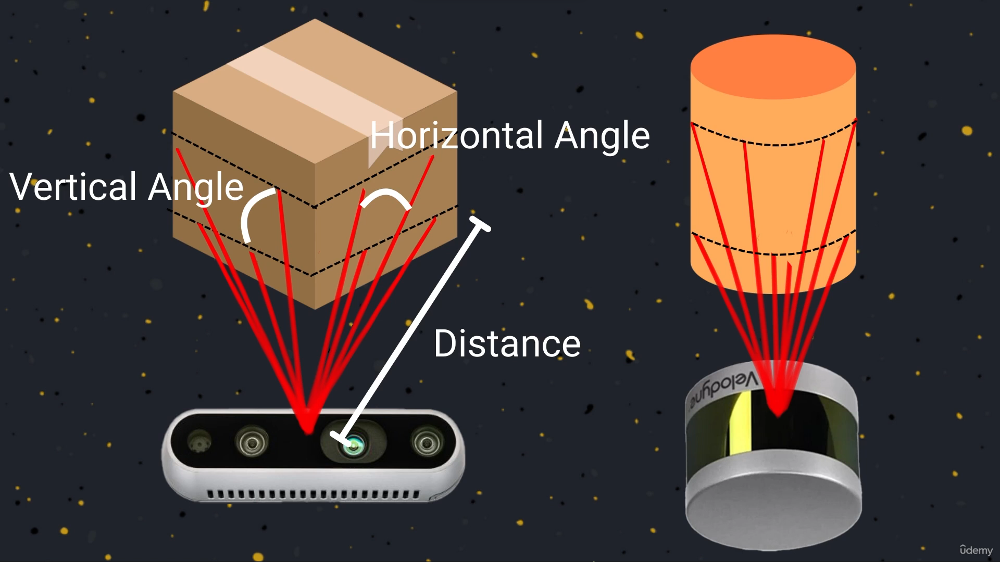

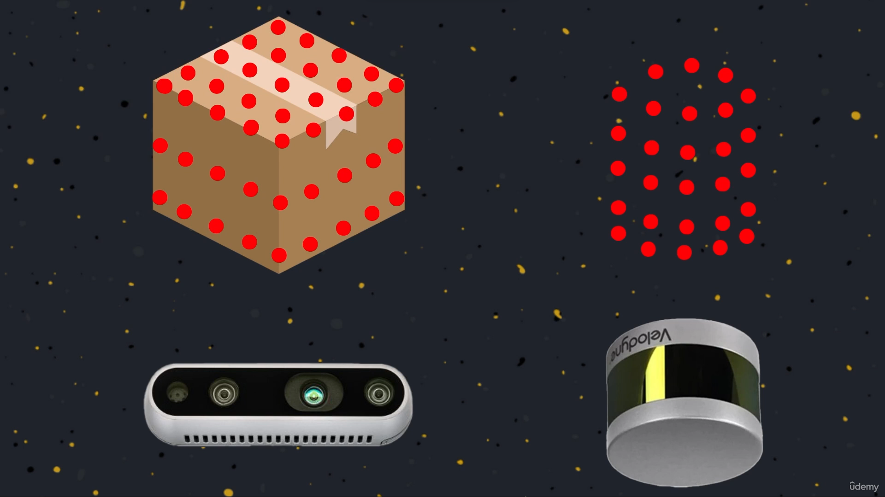

- refer [slides](https://github.com/joysmith/Self-Driving-and-ROS-2-Learn-by-Doing-Map-Localization/blob/main/06%20Sensors%20for%20localization%20and%20mapping/resources/Section6-Sensors_for_Localization_and_Mapping.pdf)

 

### 67. Speed and Separation Monitoring

- refer [slides](https://github.com/joysmith/Self-Driving-and-ROS-2-Learn-by-Doing-Map-Localization/blob/main/06%20Sensors%20for%20localization%20and%20mapping/resources/Section6-Sensors_for_Localization_and_Mapping.pdf)

 

### 68. twist_mux

 

### 69. <PY>Twist Relay</PY>

 

### 70. <C++>Twist Relay</C++>

 

### 71. <LAB>Configure twist_mux</LAB>

 

### 72. <LAB>Use twist_mux</LAB>

 

### 73. <PY>Safety Stop</PY>

 

### 74. <C++>Safety Stop</C++>

 

### 75. <LAB>Safety Stop</LAB>

 

### 76. ROS 2 Actions

 

### 77. <PY>Create an Action Server</PY>

 

### 78. <C++>Create an Action Server</C++>

 

### 79. <LAB>Create an Action Server</LAB>

 

### 80. <PY>Create an Action Client</PY>

 

### 81. <C++>Create an Action Client</C++>

 

### 82. <LAB>Create an Action Client</LAB>

 

### 83. <PY>Speed and Separation Monitoring</PY>

 

### 84. <C++>Speed and Separation Monitoring</C++>

 

### 85. <LAB>Speed and Separation Monitoring</LAB>

 

### 86. <PY>Display Markers in RViz</PY>

 

### 87. <C++>Display Markers in RViz</C++>

 

### 88. <LAB>Display Markers in RViz</LAB>

 
