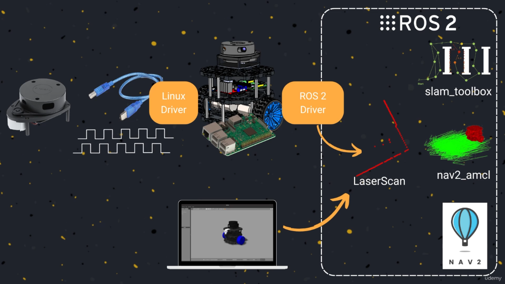

145. [Mechanics and Electronics](#145)
146. [What you are going to need](#146)
147. [ROS 2 Drivers](#147)
148. [<HWLAB>Laser Scanner ROS 2 Driver</HWLAB>](#148)
149. [<HWLAB>Assemble the Laser Sensor</HWLAB>](#149)
150. [<HWLAB>Linux udev rules</HWLAB>](#150)
151. [<HWLAB>Configure Rplidar Driver</HWLAB>](#151)
152. [<HWLAB>ROS DOMAIN ID</HWLAB>](#152)
153. [<LAB>Launch the Real Robot</LAB>](#153)

---

### 145. Mechanics and Electronics

 

### 146. What you are going to need

 

### 147. ROS 2 Drivers

 

### 148. <HWLAB>Laser Scanner ROS 2 Driver</HWLAB>

 

### 149. <HWLAB>Assemble the Laser Sensor</HWLAB>

 

### 150. <HWLAB>Linux udev rules</HWLAB>

 

### 151. <HWLAB>Configure Rplidar Driver</HWLAB>

 

### 152. <HWLAB>ROS DOMAIN ID</HWLAB>

 

### 153. <LAB>Launch the Real Robot</LAB>

 
